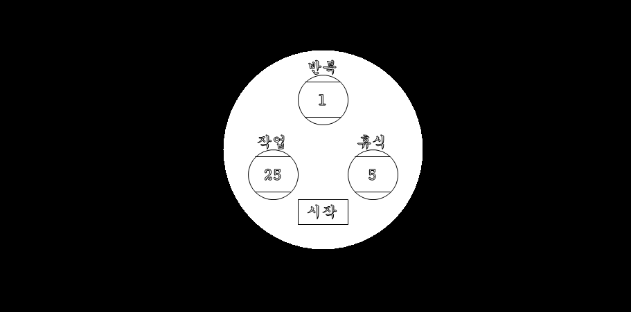

# 📌 Formodoro 
C# WinForms로 제작된 뽀모도로 타이머입니다. 
이 프로젝트는 MIT 라이선스 하에 제공되어 누구나 자유롭게 사용, 수정, 배포할 수 있습니다. 개인 또는 상업적 용도로도 활용이 가능합니다. 
  
## 📝 Description 
작업 시간과 휴식 시간, 반복 횟수를 설정할 수 있으며 아래의 단축키를 이용하여 오버레이 전용 투명 창으로 전환할 수 있습니다. 
- Alt + Shift + E : 비인터랙티브 오버레이 창으로 전환(입력 통과, 작업 전환 목록에서 제외, 반투명 적용)
  
## 🚀 Getting Started 
### 🔧 Dependencies 
Windows 10 이상 
 
### 📥 Installing 
[Releases](https://github.com/stdsic/Formodoro/releases) 페이지에서 최신 버전을 확인하실 수 있습니다. 
 
### ▶️ Executing program 
- Formodoro.exe 
  
## ❓ Help 
단독 실행 파일(.exe)로 배포하고자 .NET 런타임을 빌드에 포함하였습니다. 
이로 인해 파일의 최소 용량은 항상 50MB 이상으로 유지됩니다. 
별도의 런타임 설치 없이 바로 실행할 수 있습니다. 
  
## 👤 Authors 
- stdsic — @https://github.com/stdsic/Formodoro 
  
## 📚 Version History 
- 1.0.0 
  - 최초 릴리스 
  
## 🧾 License 
이 프로젝트는 [MIT License](LICENSE)로 라이선스되어 있습니다. 
자세한 정보는 LICENSE 파일을 참고하시기 바랍니다. 
 
